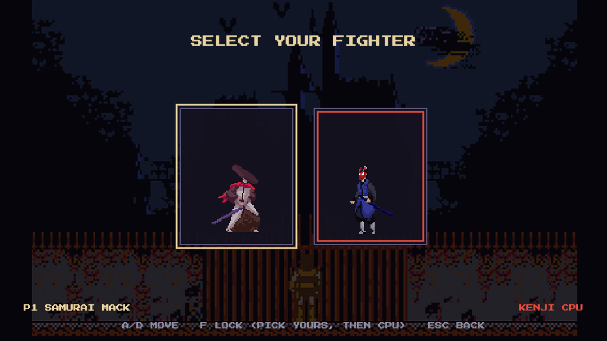
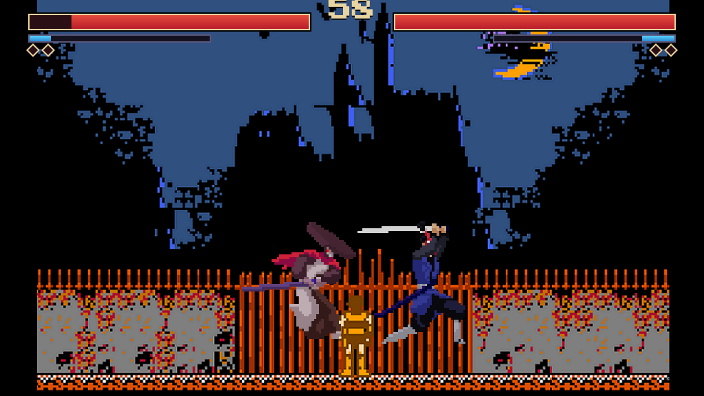

# Castlevania97

[**▶ Play Castlevania97**](https://dingtianding.github.io/Castlevania97/)

A 2D crossover fighting game in the spirit of Super Smash Bros and Marvel vs Capcom, built as a production-grade TypeScript canvas engine.
Originally a small vanilla-JS prototype, it was rebuilt from the ground up into a clean, frame-rate-independent fighting-game engine with a data-driven roster, an AI opponent, arcade mode, and full game feel.




## Modes

- **Local 2P** — two players on one keyboard (or gamepads).
- **VS CPU** — fight an AI opponent at scaling difficulty.
- **Training** — pick a fighter and dummy, then tune damage, spacing, meter, and hitboxes with an infinite timer.
- **Arcade** — climb a gauntlet of CPU fighters that get tougher each stage, ending in a demon-boss finale with a breath-fire super.
- **Boss Rush** — pick a fighter and challenge the demon finale directly.
- **Moves** — browse each fighter's archetype, stats, and named attacks.

Every match is best-of-3 rounds with a 60-second timer.

## Controls

| Action | Player 1 | Player 2 |
| --- | --- | --- |
| Move | `A` / `D` | `←` / `→` |
| Fast fall | `S` while falling | `↓` while falling |
| Jump | `W` | `↑` |
| Light attack | `F` | `.` |
| Heavy attack | `G` | `,` |
| Special / Super | `H` | `/` |

Press **special with a full meter** to spend it on a super.
Every fighter has one air jump, can attack while airborne, can fast fall, and can dash by double-tapping left or right.
Heavy attacks launch and can be jump-canceled on hit for aerial follow-ups.
Menus use `W`/`S` (or arrows) and `Enter`; `Esc` goes back.
A standard gamepad works in either player slot (left stick / d-pad to move, face buttons to attack).
Touch devices can tap through menus and use on-screen P1 movement / attack controls in battle.
Training adds `R` to reset positions and `M` to refill both meters.
Character select uses `M` to open the move list.

Each fighter builds a **super meter** by dealing and taking damage, shown under their health bar.
The Settings menu persists audio volume, reduced motion, and VS CPU difficulty in the browser.

## Engineering highlights

The rebuild fixes the original's real problems by construction and adds the systems a showcase fighter needs:

- **Fixed-timestep loop** — the simulation advances in whole 1/60s steps drained from a clamped accumulator, with rendering decoupled via interpolation, so physics and animation are identical on a 60 Hz or 144 Hz display (the original moved 2.4× faster at 144 Hz).
- **Frame-data combat** — attacks are data (`startup` / `active` / `recovery`, hitbox, knockback, hitstop, optional projectiles) and combat systems resolve world-space hitbox-vs-hurtbox each tick, replacing the old magic-frame collision check.
- **Air combat foundation** — universal double jump, fast fall, dash/backdash, landing recovery, and airborne attacks push the game toward platform-fighter movement and Marvel-style jump-in pressure.
- **Launcher routes** — heavy attacks pop opponents upward and open a short jump-cancel window for air follow-ups.
- **Explicit Fighter FSM** — a transition table drives locomotion and time-driven action states (attack / hurt / death), so each fighter reasons about its own state (the original had a copy-paste bug where the enemy animated off the player's velocity).
- **Input abstraction** — keyboard, gamepad, and AI all implement one `InputSource` that emits a per-tick intent; the AI is "just another controller," so 1P-vs-CPU needed zero combat-code changes.
- **Data-driven roster** — each fighter is a `CharacterDef` (sprites, hurtbox, full moveset) collected by a registry; adding a character is one file.
- **Expanded content** — three playable fighters plus a boss-only demon finale, with projectile supers and a dedicated Boss Rush route.
- **Character identity layer** — select screen archetypes, stat bars, move names, and match intro callouts make the roster easier to read and tune.
- **Training tools** — infinite timer, passive dummy, full-meter refill, reset shortcut, spacing/damage/combo overlay, and `?hitbox` support for frame-data tuning.
- **Move list** — a roster browser built from `CharacterDef.meta`, so move names and stats stay in one source of truth.
- **Game feel** — hitstop, trauma-based screen shake (reduce-motion aware), pooled hit-spark particles, KO slow-motion, and a WebAudio mixer with streamed BGM and procedurally synthesized SFX.
- **Scenes** — a scene-stack manager (Boot → Load → Title → ModeSelect → CharacterSelect → Battle → Result) with overlay support.

## Tech stack

- **TypeScript** (strict, `noUncheckedIndexedAccess`, `exactOptionalPropertyTypes`) for all game logic.
- **Canvas 2D** for rendering (pixel-perfect, `imageSmoothingEnabled = false`), **WebAudio** for sound.
- **Vite** for dev/build, deployed to **GitHub Pages** via **GitHub Actions** (build from source — no committed bundle).

## Development

```bash
npm install
npm run dev        # local dev server
npm run typecheck  # strict type check
npm run build      # type check + production build
npm run preview    # serve the production build
```

Append `?hitbox` to the URL to see the hitbox / hurtbox / pushbox debug overlay.
